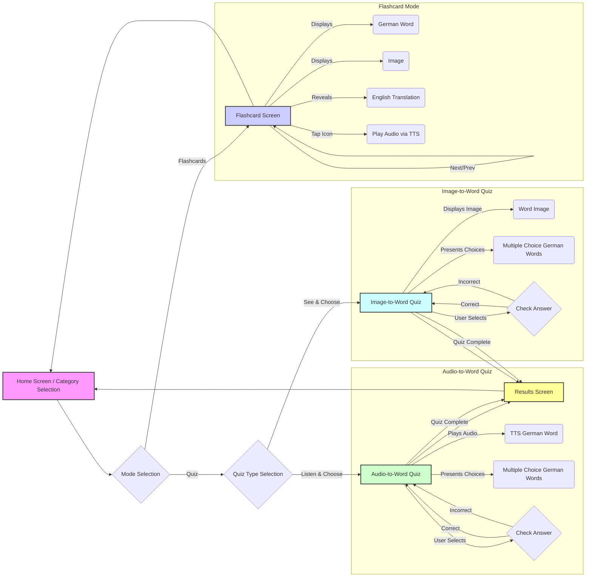

# German Learning App Plan

**1. Project Goal:**

*   Develop a mobile application using Flutter for children aged 7+ to learn a predefined list of German words through interactive flashcards (with audio and images) and engaging quizzes (audio-to-word and image-to-word matching), preparing them for a reading contest.

**2. Core Features:**

*   **Word Categories:** Group the provided words into their categories.
*   **Category Selection:** Allow users to choose a category to study.
*   **Flashcards:**
    *   Display the German word prominently.
    *   Show the corresponding image.
    *   Show the English translation (perhaps initially hidden, revealed on tap).
    *   Include an icon (e.g., a speaker symbol) that, when tapped, plays the German pronunciation via TTS.
    *   Allow navigation through the words in the selected category.
*   **Quizzes (Two Types):**
    *   **Audio-to-Word:** The app plays the German audio for a word (using TTS), and the user selects the correct written German word from multiple choices.
    *   **Image-to-Word:** The app displays the image for a word, and the user selects the correct written German word from multiple choices.
    *   Quizzes based on the selected category (or multiple categories).
    *   Provide immediate feedback.
*   **Results:** Display the quiz score at the end.

**3. Data Management:**

*   **Word Model:** Create a Dart class (`Word`) with fields:
    *   `germanWord`: String
    *   `englishWord`: String
    *   `category`: String (or Enum)
    *   `imagePath`: String (Path to the corresponding image asset within the project)
*   **Word List:** Store the word data (including image paths) within the app, likely in a Dart list or a JSON file.
*   **Image Assets:** **Crucially, we will need image files (e.g., PNG, JPG) for each word.** These images need to be sourced or created and added to the Flutter project's `assets` directory.

**4. Technical Approach & Key Packages:**

*   **Framework:** Flutter & Dart
*   **State Management:** `Provider` or `Riverpod`.
*   **Audio Playback:** `flutter_tts` package for TTS.
*   **Image Display:** Standard Flutter `Image.asset` widget.
*   **UI Components:** Material Components.

**5. App Structure & Screen Flow:**

**6. Development Steps (High-Level):**

1.  **Setup:** Initialize Flutter project, add dependencies (`flutter_tts`, state management).
2.  **Assets:** **Source/create image files for all words.** Add them to an `assets/images/` folder and declare this folder in `pubspec.yaml`.
3.  **Data:** Define the `Word` model (including `imagePath`). Populate the word list data, ensuring image paths match the asset files.
4.  **UI - Screens:** Build UI for:
    *   Category Selection
    *   Flashcard Screen (layout for word, image, translation, audio button)
    *   Quiz Type Selection Screen
    *   Audio-to-Word Quiz Screen
    *   Image-to-Word Quiz Screen
    *   Results Screen
5.  **Logic - Flashcards:** Implement category loading, display, reveal, TTS integration.
6.  **Logic - Quizzes:** Implement logic for both quiz types (generating questions/choices from the word list, handling audio playback for the audio quiz, checking answers, scoring).
7.  **Navigation:** Set up routing.
8.  **Styling:** Apply child-friendly themes.
9.  **Testing:** Unit/widget tests.
